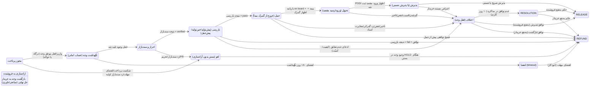

```mermaid
stateDiagram-v2
direction LR
    AUTHORIZE : مجوز پرداخت
    HOLD : نگهداشت وجه (حساب امانی)
    VERIFY : احراز و سندبازار
    INSPECT : بازرسی (پیش‌تولید/حین‌تولید/پیش‌حمل)
    SHIP : حمل (خروج از گمرک مبدأ)
    DELIVERY : تحویل (ورود/رسید مقصد)
    ACCEPT : پذیرش (یا پذیرش ضمنی)
    RELEASE [*] : آزادسازی به فروشنده
    REFUND [*] : بازگشت وجه به خریدار
    DISPUTE : اختلاف (قفل وجه)
    RESOLUTION [*] : حل نهایی (میانجی/داوری)
    CANCELLED : لغو (بستن بدون آزادسازی)
    EXPIRED : انقضا (timeout)
    AUTHORIZE --> HOLD : واریز/قفل موفق وجه (درگاه یا حواله)
    AUTHORIZE --> CANCELLED : شکست پرداخت/انقضای مهلت/رد سندبازار اولیه
    HOLD --> VERIFY : قفل وجوه تأیید شد
    HOLD --> EXPIRED : انقضای ۱۸۰ روز نگهداشت
    VERIFY --> INSPECT : نتیجه سندبازار = verified
    VERIFY --> CANCELLED : رد سندبازار/تحریم/PR
    INSPECT --> SHIP : نتیجه بازرسی = pass
    INSPECT --> REFUND : نتیجه بازرسی = fail + توافق
    INSPECT --> DISPUTE : ادعای عدم تطابق (کیفیت/کمیّت)
    SHIP --> DELIVERY : بارنامه on board + بیمه + اظهار گمرک
    SHIP --> DISPUTE : تأخیر/نقض/رد گمرکی/مغایرت اسناد
    SHIP --> REFUND : فسخ توافقی پیش از حمل
    DELIVERY --> ACCEPT : POD/اظهار ورود مقصد ثبت شد
    DELIVERY --> DISPUTE : گم‌شدن/آسیب/نقص/تأخیر
    ACCEPT --> RELEASE : پذیرش صریح یا ضمنی
    ACCEPT --> DISPUTE : اعتراض مستند خریدار
    DISPUTE --> RESOLUTION : عدم توافق در مذاکره (۱۰ روز کاری)
    DISPUTE --> RELEASE : توافق/پذیرش (به‌نفع فروشنده)
    DISPUTE --> REFUND : توافق/بازگشت (به‌نفع خریدار)
    RESOLUTION --> RELEASE : حکم به‌نفع فروشنده
    RESOLUTION --> REFUND : حکم به‌نفع خریدار
    CANCELLED --> REFUND : وجود وجه در HOLD هنگام بستن
    EXPIRED --> REFUND : انقضای مهلت (خودکار)
```
